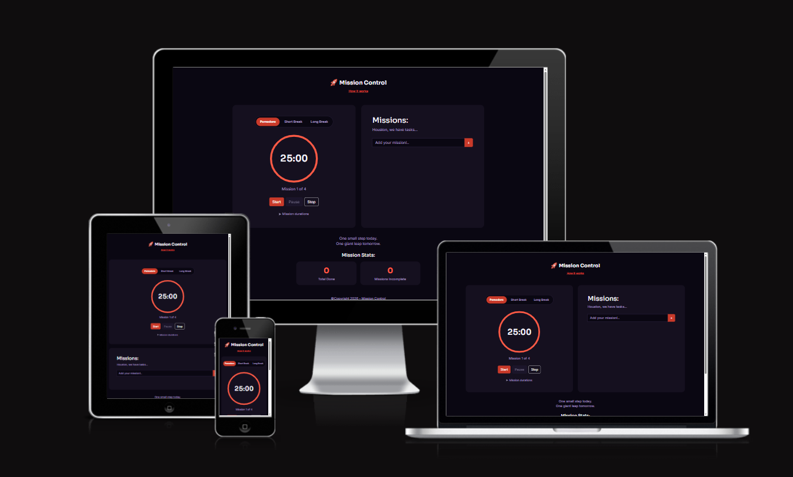
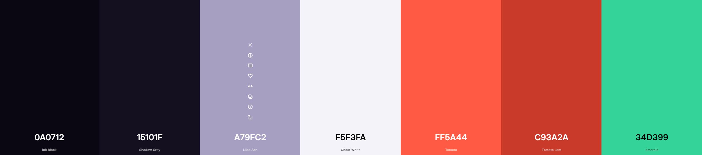
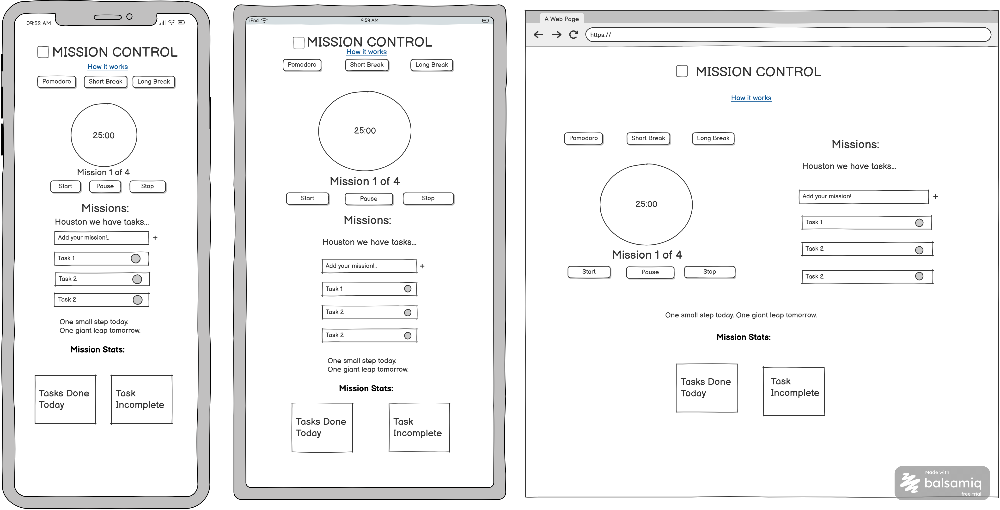
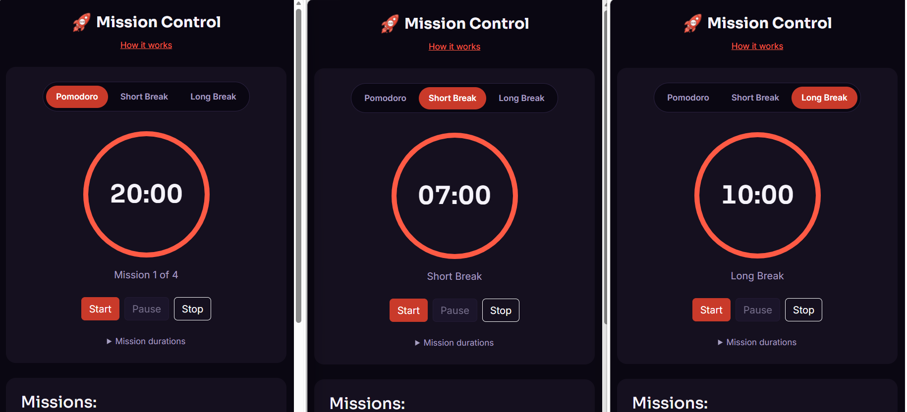
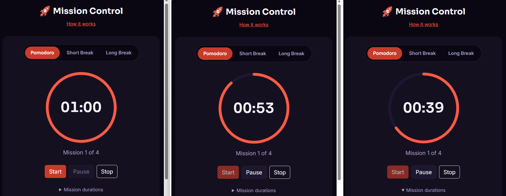
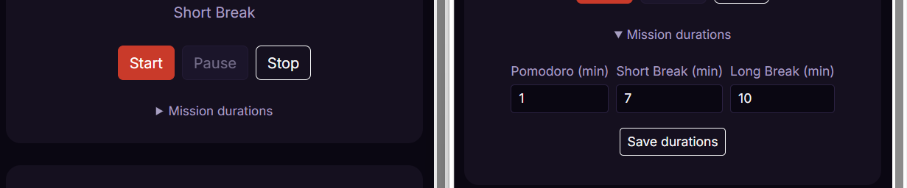
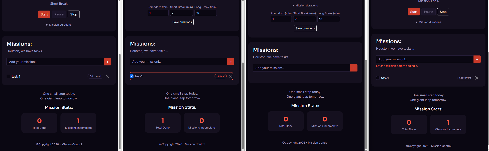
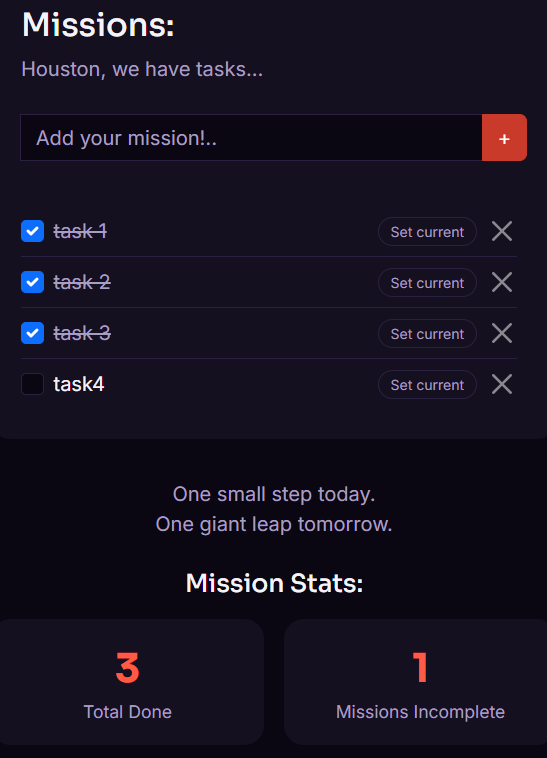
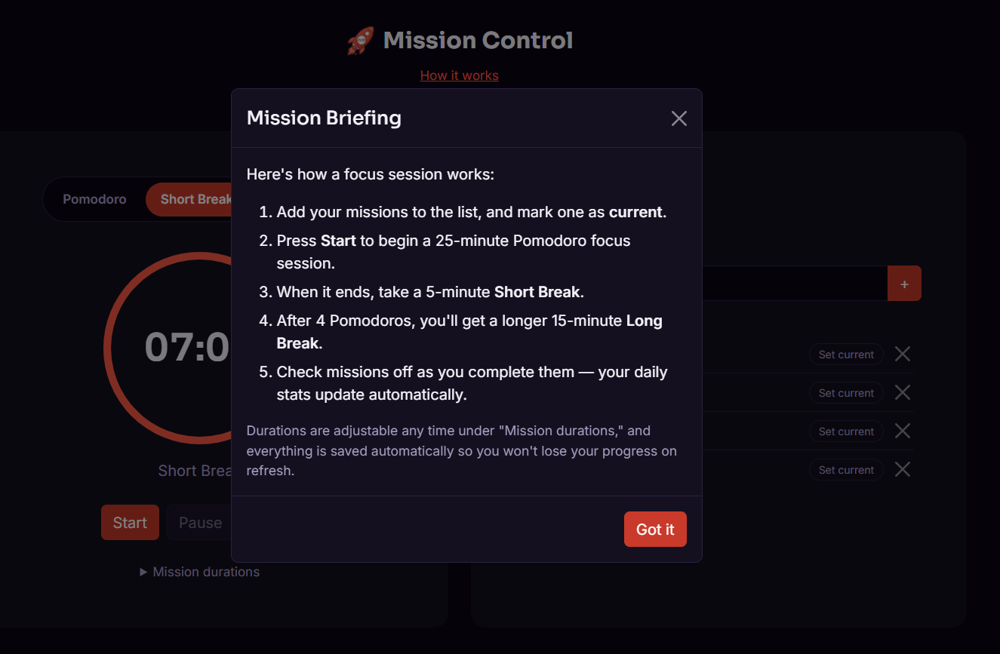
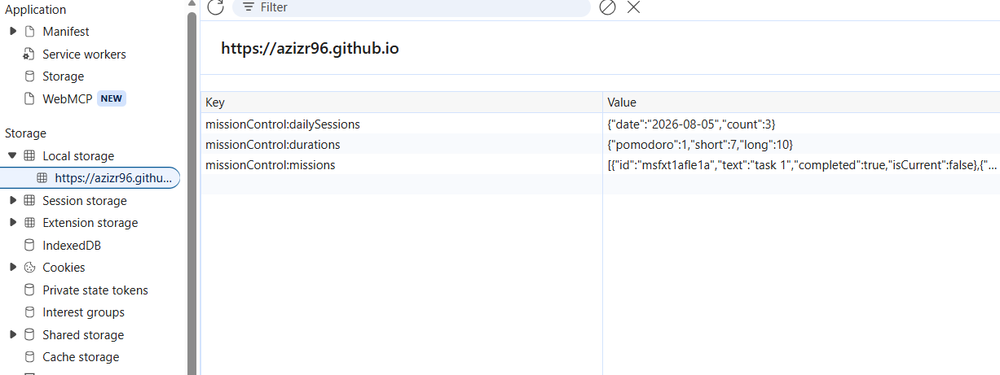

# [Mission Control](https://azizr96.github.io/mission-control)
 
A Pomodoro focus timer with an integrated mission (task) list, built as a JavaScript Group Project for the AI Augmented FullStack Bootcamp.
 
Developers: 
Rauhan Aziz ([Azizr96](https://www.github.com/Azizr96)),
Amir Mohammadi ([amirmhmdi](https://github.com/amirmhmdi)),
Davy K. Berry ([davy-berry](https://github.com/davy-berry)),
Sarah J Hill ([sarahjhill](https://github.com/sarahjhill))


<!-- Add GitHub profile links for Sarah / Amir / Davy once available -->
 
[](https://www.github.com/Azizr96/mission-control/commits/main)
[](https://www.github.com/Azizr96/mission-control/commits/main)
[](https://www.github.com/Azizr96/mission-control)
[](https://azizr96.github.io/mission-control)
 
## Introduction
 
Mission Control is a single-page Pomodoro timer paired with a task list, wrapped in a "mission control" theme. Timer sessions are Pomodoros, tasks are missions, and progress is tracked as Mission Stats. It's built for anyone who wants a focused, distraction-free way to structure work into timed intervals: students revising for exams, developers deep in a coding session, or anyone using the Pomodoro Technique (25 minutes of focus, 5-minute breaks, a longer break every 4th cycle) to manage their attention.
 
We selected this project because effective time management and maintaining focus are challenges that every member of the team has experienced personally. A Pomodoro timer offered a well-defined yet meaningful problem to solve, providing opportunities to demonstrate thoughtful UX design through features such as a live countdown, mode switching, and data persistence. It also allowed us to incorporate accessibility best practices, including keyboard navigation, screen-reader support, and WCAG-compliant colour contrast, making it an ideal project for showcasing the full range of skills required by the assessment.
 

 
source: [mission-control amiresponsive](https://ui.dev/amiresponsive?url=https://azizr96.github.io/mission-control)
 
## UX
 
### The 5 Planes of UX
 
#### 1. Strategy
 
**Purpose**
- Give users a simple, focused way to run Pomodoro sessions without leaving the page.
- Let users track missions (tasks) alongside their focus sessions, so the timer and the work list live in one place.
- Make the whole experience accessible: keyboard-navigable, screen-reader friendly, and WCAG-contrast-checked by design, not as an afterthought.
**Primary User Needs**
- Start, pause, and reset a focus session without confusion about which mode is active.
- Add, complete, and remove tasks quickly, and mark one as the current focus.
- Trust that progress (missions, durations) survives a page refresh.
**Business/Project Goals**
- Meet the bootcamp's assessment criteria for front-end design, interactivity, validation, deployment, documentation, and AI-tool usage.
- Demonstrate genuine team collaboration through a clear Git history and divided ownership of features.
#### 2. Scope
 
**[Features](#features)** (see below)
 
**Content Requirements**
- Clear mode labels (Pomodoro / Short Break / Long Break) and an always-visible countdown.
- An accessible mission list: add, complete, delete, and mark-as-current, with empty-input validation.
- A live, on-screen Mission Stats summary (missions done / incomplete).
- A short in-app instructions modal for first-time users.
#### 3. Structure
 
**Information Architecture**
- Single page, two main panels: the Timer panel and the Missions panel, side by side on desktop and stacked on mobile/tablet.
- A full-width Mission Stats strip beneath both panels.
- An instructions modal, reachable from a "How it works" link in the header, for on-demand guidance rather than cluttering the main layout.
**User Flow**
1. User lands on the page and (optionally) opens "How it works" for a quick briefing.
2. User adds one or more missions to the list, optionally marking one as current.
3. User presses Start to begin a 25-minute Pomodoro session.
4. On completion, the app automatically switches to a Short Break (or, every 4th cycle, a Long Break).
5. User checks off missions as they're completed; Mission Stats update live.
6. Settings (durations) and all missions persist automatically between visits.
#### 4. Skeleton
 
**[Wireframes](#wireframes)** (see below)
 
#### 5. Surface
 
**Visual Design Elements**
- **[Colour Scheme](#colour-scheme)** (see below)
- **[Typography](#typography)** (see below)


### Colour Scheme
 
The palette is a dark, near-black background with a tomato-red accent — a nod to "Pomodoro" (Italian for tomato). Every text/background pairing below was checked against the WCAG 2.1 contrast formula rather than chosen by eye.
 
- `#0A0712` page background
- `#15101F` panel background
- `#1E1730` raised surfaces (list items, inputs)
- `#F5F3FA` primary text — 18.1:1 on the page background (AAA)
- `#A79FC2` secondary/muted text — 8.0:1 on the page background (AAA)
- `#FF5A44` accent (tomato) — 6.5:1 on the page background (AA), used for links, the progress ring, and small accents
- `#C93A2A` button fill — white text on this reaches 5.1:1 (AA)
- `#34D399` success (completed missions) — 10.4:1 on the page background (AAA)

 
### Typography
 
- [Sora](https://fonts.google.com/specimen/Sora) (Google Fonts) is used for headings and the timer digits.
- [Inter](https://fonts.google.com/specimen/Inter) (Google Fonts) is used for all body and UI text.
- [Fav icon](https://favicon.io/)(Fav icon) is used for the window tab icon.

## Wireframes
 
Wireframes were designed for mobile, tablet, and desktop using [Balsamiq](https://balsamiq.com/wireframes).
 
  
 
## User Stories
 
| Target | Expectation | Outcome |
| --- | --- | --- |
| As a user | I want to start a focus timer | so that I can begin a work session. |
| As a user | I want to pause and resume the timer | so that I can handle interruptions without losing progress. |
| As a user | I want to reset the current session | so that I can start over if I get distracted. |
| As a user | I want to switch between Focus, Short Break, and Long Break | so that I can follow the Pomodoro structure. |
| As a user | I want the timer to automatically move to the next session type | so that I don't have to manually switch every time. |
| As a user | I want to set my own durations for focus and break sessions | so that I can tailor the timer to my own workflow. |
| As a user | I want a sound or visual alert when a session ends | so that I notice even if I'm not looking at the screen. |
| As a user | I want to add a task to my list | so that I can track what I'm working on. |
| As a user | I want to check off a task when it's done | so that I can see my progress. |
| As a user | I want to remove a task from my list | so that I can clean up items I no longer need. |
| As a user | I want to mark which task I'm actively working on | so that it's clear what my current focus session is for. |
| As a user | I want my task list to still be there if I refresh the page | so that I don't lose my list. |
| As a user | I want my custom durations to be remembered | so that I don't have to reset them every visit. |
| As a user | I want to see how many focus sessions I've completed today | so that I feel a sense of progress. |
| As a user relying on assistive technology | I want the page to use semantic HTML and pass accessibility checks | so that I can navigate and use the app regardless of ability. |
| As a user on any device | I want the layout to adapt to my screen size | so that the app is usable on mobile, tablet, and desktop. |
| As a user | I want to access the app online | so that I don't need to run it locally. |

 
## Features
 
### Existing Features
 
| Feature | Notes | Screenshot |
| --- | --- | --- |
| Mode tabs | Pomodoro / Short Break / Long Break, styled as pill tabs. Switching modes resets the timer to that mode's duration. |  |
| Timer ring | A circular SVG progress ring drains as the session counts down, alongside a large digital readout. |  |
| Timer controls | Start / Pause / Stop, with correct button states (e.g. Pause disabled until a session is running). |  |
| Mission durations | A collapsible settings panel lets users set custom minute values per mode, validated to whole numbers between 1-90. |  |
| Mission list | Add, complete, delete, and mark-as-current, with empty-input validation. The list scrolls internally past ~5 items instead of growing the page indefinitely. |  |
| Mission Stats | Live counts of missions done vs. incomplete. |  |
| Instructions modal | A "How it works" link opens a Bootstrap modal briefing first-time users on the focus-session flow. |  |
| Persistence | Missions and duration settings are saved to `localStorage` and restored automatically on return visits. |  |
| Accessibility | Semantic HTML, ARIA live regions for timer/task state, full keyboard navigation, and a visible focus ring throughout. | Please see deployed link |
 
### Future Features
 
- **Session history**: a log of completed Pomodoro sessions with timestamps, beyond today's count.
- **Multiple mission lists**: separate lists for different projects or contexts.
- **Custom notification sounds**: let users choose or upload their own end-of-session sound instead of the synthesized beep.
- **Themes**: a light-mode or alternate accent-color option alongside the current dark tomato theme.
- **Browser notifications**: an optional native notification when a session ends and the tab isn't focused.


## Tools & Technologies


## Agile Development Process

### GitHub Projects
 
[GitHub Projects](https://www.github.com/Azizr96/mission-control/projects) was used as an Agile tool. User stories were broken down by epic (Timer, Missions, Persistence, Accessibility) and tracked on a Kanban board, split across four owners.
 

 
### GitHub Issues
 
[GitHub Issues](https://www.github.com/Azizr96/mission-control/issues) was used to track user stories, tasks, and bugs individually.
 
| Link | 
| --- | 
| [](https://www.github.com/Azizr96/mission-control/issues?q=is%3Aissue%20is%3Aopen%20-label%3Abug) 
| [](https://www.github.com/Azizr96/mission-control/issues?q=is%3Aissue%20is%3Aclosed%20-label%3Abug) 
 
### MoSCoW Prioritization
 
User stories were prioritized using MoSCoW and split across the team by feature area:
 
- **Must have**: Timer core (start/pause/reset/mode switching/auto-transition), Mission CRUD, basic persistence.
- **Should have**: Custom durations, settings persistence, accessibility pass, responsive layout.
- **Could have**: Notification sound, daily session stats.
- **Required throughout**: validation, deployment, version control, documentation, code organization, AI-usage reflection.

## Testing
 
> [!NOTE]  
> For all testing, please refer to the [TESTING.md](TESTING.md) file.

## Deployment

### GitHub Pages
 
The site is deployed to GitHub Pages:
 
- In the [GitHub repository](https://www.github.com/Azizr96/mission-control), go to **Settings**.
- Click **Pages** in the left-hand menu.
- Under **Build and deployment**, set the **Branch** to `main`, then **Save**.
- Allow a few minutes for the deployment to complete.
The live link is on [GitHub Pages](https://azizr96.github.io/mission-control).

### Local Development
 
This project uses native ES modules (`<script type="module">`), which browsers block from a plain `file://` page due to CORS. Serve the folder with a local dev server instead:
 
1. Clone the repository: `git clone https://www.github.com/Azizr96/mission-control.git`
2. Open the folder in VS Code and run it with the **Live Server** extension, or:
```bash
   python3 -m http.server 8000
```
3. Open `http://localhost:8000` in your browser.

### Local vs. Deployment
 
There are no known functional differences between the local version and the deployed version.