# Testing
 
> [!NOTE]  
> Return back to the [README.md](README.md) file.
 
## Code Validation
 
### HTML
 
The recommended [HTML W3C Validator](https://validator.w3.org) was used to validate all HTML files.
 
| Directory | File | URL | Screenshot | Notes |
| --- | --- | --- | --- | --- |
|  | [index.html](https://github.com/Azizr96/mission-control/blob/main/index.html) | [HTML Validator](https://validator.w3.org/nu/?doc=https://azizr96.github.io/mission-control/index.html) |  |  |
 
### CSS
 
The recommended [CSS Jigsaw Validator](https://jigsaw.w3.org/css-validator) was used to validate all CSS files. Bootstrap's own CSS is a third-party framework and was not validated, per Code Institute guidance.
 
| Directory | File | URL | Screenshot | Notes |
| --- | --- | --- | --- | --- |
| css | [style.css](https://github.com/Azizr96/mission-control/blob/main/css/style.css) | [CSS Validator](https://jigsaw.w3.org/css-validator/validator?uri=https://azizr96.github.io/mission-control) | 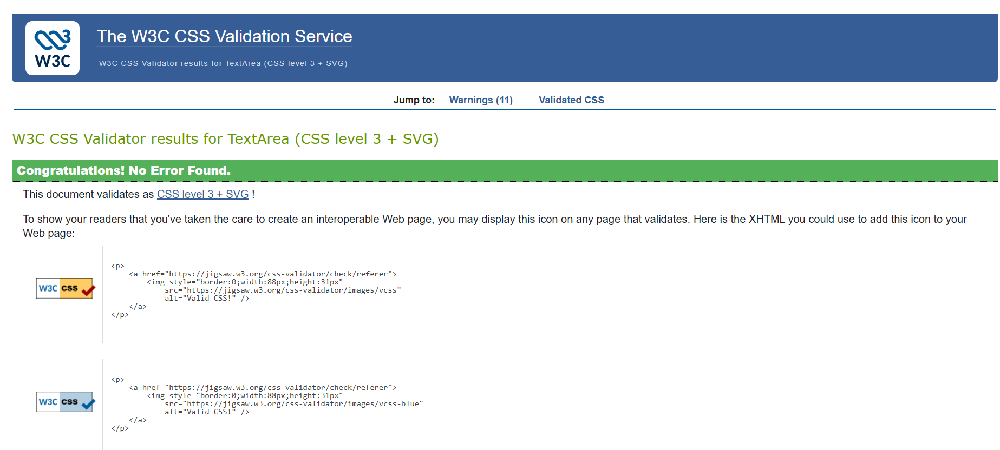 |  |
 
### JavaScript
 
The recommended [JSHint Validator](https://jshint.com) was used to validate all JS files.
 
> [!IMPORTANT]  
> Every JS file uses native ES module `import`/`export` syntax. JSHint needs to be told this explicitly, or it will flag `import`/`export` as syntax errors. Add this directive as the very first line of each JS file before validating:
>
> `/* jshint esversion: 11, module: true */`
>
> Any resulting "unused variable" warnings for imported functions (e.g. `loadJSON`, `saveJSON` imported but only used inside specific functions) are expected and acceptable — JSHint can't always trace usage across ES module boundaries.
 
| Directory | File | URL | Screenshot | Notes |
| --- | --- | --- | --- | --- |
| js | [script.js](https://github.com/Azizr96/mission-control/blob/main/js/app.js) | [JSHint Validator](https://jshint.com) | 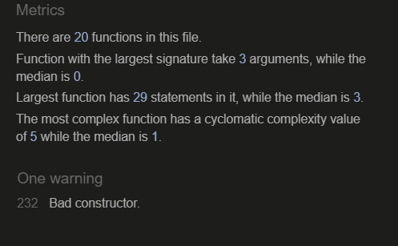 | The bad constructor warning is due to linter not supporting newer ES features. however the code is correct and uses correct jaavscript coding methodologies.  |
| js | [timer.js](https://github.com/Azizr96/mission-control/blob/main/js/timer.js) | [JSHint Validator](https://jshint.com) | 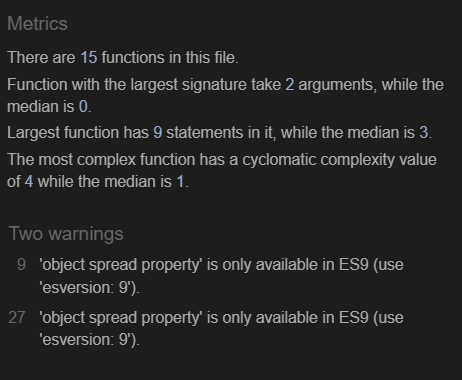 | Linter does not support ES9 features therefore this error shows, however this does nto effect the quality of the code.  |
| js | [tasks.js](https://github.com/Azizr96/mission-control/blob/main/js/tasks.js) | [JSHint Validator](https://jshint.com) | 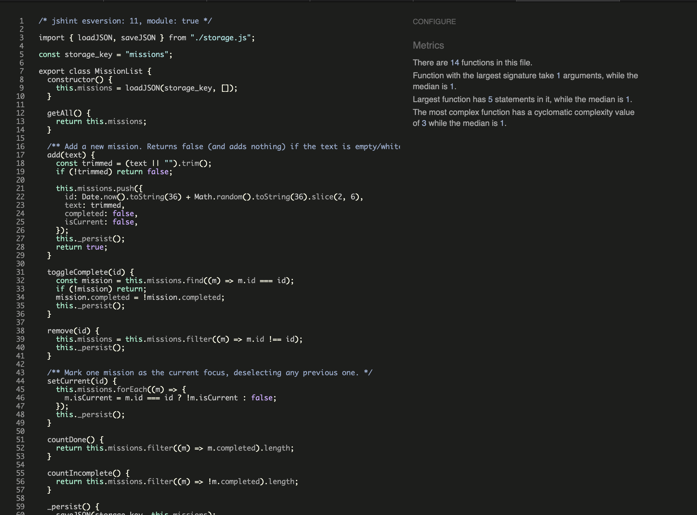 |  |
| js | [storage.js](https://github.com/Azizr96/mission-control/blob/main/js/storage.js) | [JSHint Validator](https://jshint.com) | 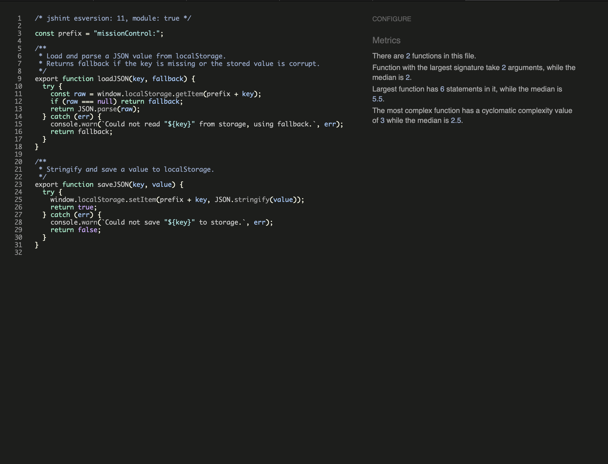 |  |
 
## Responsiveness
 
The deployed site was tested at mobile, tablet, and desktop widths using browser DevTools device sizes.
 
| Page | Mobile | Tablet | Desktop | Notes |
| --- | --- | --- | --- | --- |
| Home | 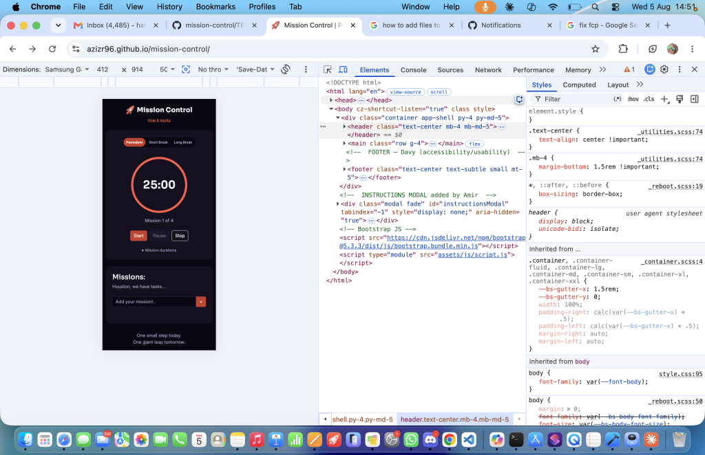 | 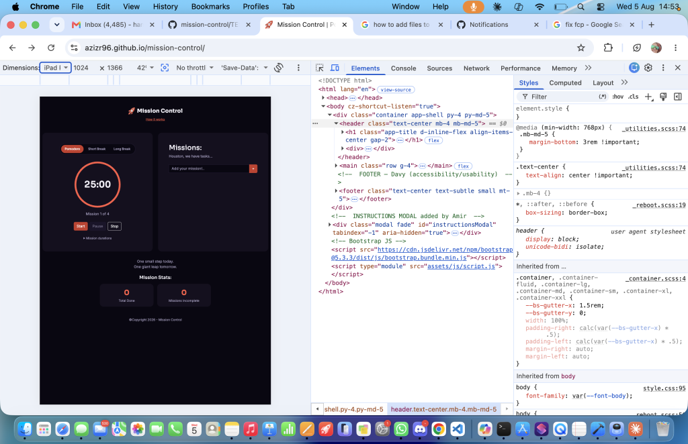 | 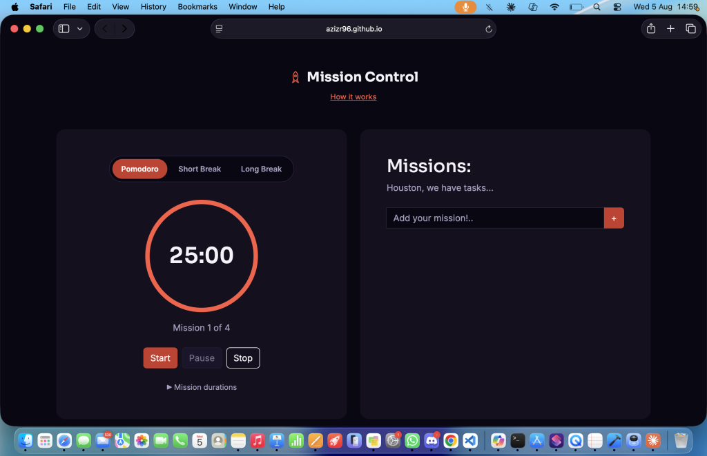 | Works as expected |
| Instructions modal | 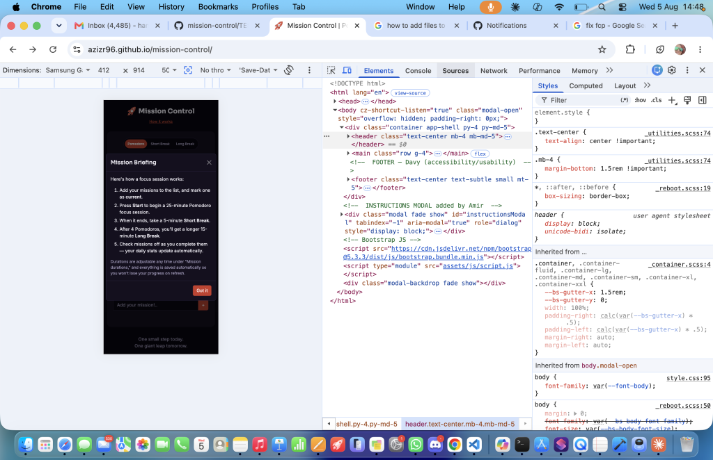 | 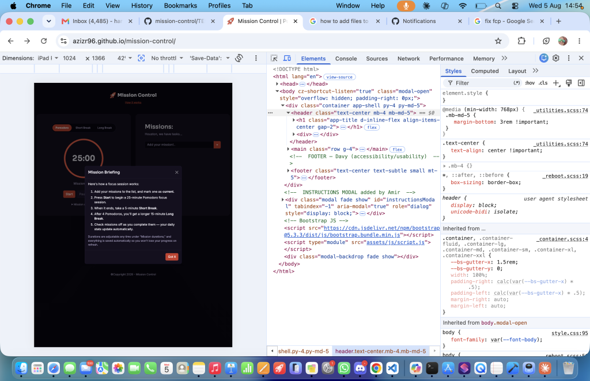 | 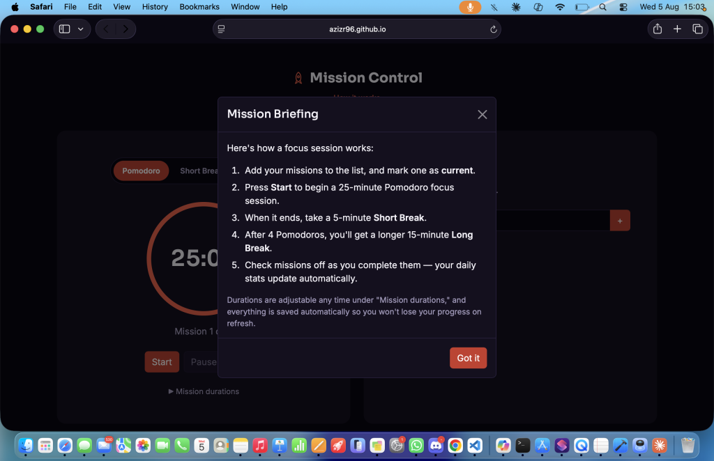 | Works as expected |
 
## Browser Compatibility
 
The deployed site was tested across multiple browsers to check for compatibility issues.
 
| Page | Chrome | Firefox | Safari | Notes |
| --- | --- | --- | --- | --- |
| Home |  |  |  | Works as expected |
 
## Lighthouse Audit
 
The deployed site was tested using the Lighthouse Audit tool in Chrome DevTools, for both mobile and desktop.
 
| Page | Mobile | Desktop |
| --- | --- | --- |
| Home |  |  |
 

## Accesbility test

The deployed site was tested using the [WAVE](https://wave.webaim.org/) web accessbility tester

| Test | Screenshot |  
| --- | --- |
| WAVE | 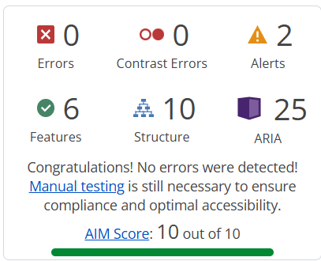 |

## Defensive Programming
 
Defensive programming was manually tested with the below user acceptance testing:
 
| Page/Feature | Expectation | Test | Result | 
| --- | --- | --- | --- | 
| Timer controls | Start begins the countdown and disables itself while Pause becomes enabled. | Pressed Start from a fresh page load. | Behaved as expected. | 
| Timer controls | Pause stops the countdown at the exact remaining time; resuming continues from there, not from the start. | Started the timer, paused partway through, then resumed. | Behaved as expected. | 
| Timer controls | Stop resets the timer to the full duration for the current mode. | Started the timer, let it run, then pressed Stop. | Behaved as expected. | 
| Mode tabs | Switching modes resets the timer to that mode's duration, even mid-session. | Started a Pomodoro session, then clicked Short Break mid-countdown. | Behaved as expected. | 
| Auto-transition | After 4 completed Pomodoros, the next break is a Long Break instead of a Short Break. | Manually completed 4 Pomodoro cycles in sequence. | Behaved as expected. | 
| Mission durations | Invalid input (empty, zero, negative, non-numeric, or over 90) is rejected with an on-screen error. | Tried submitting each type of invalid value in the durations form. | Error message displayed as expected; valid values were accepted and applied. | 
| Add mission | Submitting an empty or whitespace-only mission is rejected with an on-screen error, and nothing is added to the list. | Submitted the mission form with the input empty and with only spaces. | Error message displayed as expected; no empty items were added. | 
| Mission list | Completing, deleting, and marking a mission as current all update the list and Mission Stats correctly, for the first, middle, and last item in the list. | Tested each action against items in each list position. | Behaved as expected in all positions. | 
| Mission list scrolling | Once the list grows past ~5 missions, it scrolls internally instead of expanding the page. | Added 10+ missions and observed the list container. | List scrolled as expected; page layout stayed fixed. | 
| Persistence | Missions and duration settings survive a full page refresh. | Added missions, changed durations, then refreshed the page. | All data was restored correctly. | 
| Accessibility | All interactive elements (tabs, buttons, form fields, mission actions) are reachable and operable via keyboard alone, with a visible focus indicator. | Tabbed through the entire page using only the keyboard. | All elements were reachable and clearly focused; no keyboard traps. | 
| Instructions modal | The modal opens on click, is dismissible via the close button, the "Got it" button, and the Escape key, and returns focus sensibly afterward. | Opened and closed the modal using each method. | Behaved as expected. | 
 
## User Story Testing
 
| Target | Expectation | Outcome | Screenshot |
| --- | --- | --- | --- |
| As a user | I want to start a focus timer | so that I can begin a work session. |  |
| As a user | I want to pause and resume the timer | so that I can handle interruptions without losing progress. |  |
| As a user | I want to reset the current session | so that I can start over if I get distracted. |  |
| As a user | I want to switch between Focus, Short Break, and Long Break | so that I can follow the Pomodoro structure. |  |
| As a user | I want the timer to automatically move to the next session type | so that I don't have to manually switch every time. |  |
| As a user | I want to set my own durations for focus and break sessions | so that I can tailor the timer to my own workflow. |  |
| As a user | I want to add a task to my list | so that I can track what I'm working on. |  |
| As a user | I want to check off a task when it's done | so that I can see my progress. |  |
| As a user | I want to remove a task from my list | so that I can clean up items I no longer need. |  |
| As a user | I want to mark which task I'm actively working on | so that it's clear what my current focus session is for. |  |
| As a user | I want my task list to still be there if I refresh the page | so that I don't lose my list. |  |
| As a user relying on assistive technology | I want the page to use semantic HTML and pass accessibility checks | so that I can navigate and use the app regardless of ability. |  |
| As a user on any device | I want the layout to adapt to my screen size | so that the app is usable on mobile, tablet, and desktop. |  |
 
## Bugs
 
### Fixed Bugs
 
[GitHub Issues](https://www.github.com/Azizr96/mission-control/issues) was used to track and manage bugs during development. All closed/fixed bugs can be tracked [here](https://www.github.com/Azizr96/mission-control/issues?q=is%3Aissue+is%3Aclosed+label%3Abug).
 

 
A few notable bugs found and fixed during AI-assisted development, worth documenting for the LO6.2 reflection:
 
| Bug | Cause | Fix |
| --- | --- | --- |
| "Start" button and other Bootstrap buttons stayed the default Bootstrap blue instead of the theme's tomato-red. | Bootstrap's compiled `.btn-primary` CSS ships with literal hex colors baked in at build time — it does not read the `--bs-primary` custom property at runtime, despite that being the intuitive way to theme it. | Overrode each button's own local Bootstrap variables (`--bs-btn-bg`, `--bs-btn-hover-bg`, etc.) directly in `style.css` instead of relying on the theme-color variable. |
| Muted/secondary text (taglines, captions) was rendering almost invisible against the dark background. | Bootstrap's `.text-secondary` utility class is tied to the *button* theme color variable, not a separate "muted text" token — remapping one for buttons silently broke the other. | Introduced a dedicated `.text-subtle` class, decoupled from Bootstrap's secondary theme color. |
| An entire CSS rule (`.btn-primary`) was silently dropped by the browser and had no effect. | A code comment contained a literal `*/` partway through its text, which closed the CSS comment early and corrupted everything up to the next `*/` in the file. | Reworded the comment to avoid the character sequence `*/` appearing outside of an actual comment close. |
 
### Unfixed Bugs
 
Any remaining open issues can be tracked [here](https://www.github.com/Azizr96/mission-control/issues?q=is%3Aissue+is%3Aopen+label%3Abug).
 

 
### Known Issues
 
| Issue | 
| --- | 
| Bootstrap's `lg` grid breakpoint switches to the two-column desktop layout at 992px, not exactly 1024px as shown in the original wireframes. This is a deliberate trade-off of using Bootstrap's default grid rather than a custom breakpoint. |  
| The project must be served over `http(s)` (e.g. via Live Server or GitHub Pages) rather than opened directly as a local `file://` page, since native ES modules are blocked by CORS from `file://` origins. This is expected browser behavior, not a bug. |  
 
> [!IMPORTANT]  
> There are no remaining bugs that we are aware of, though, even after thorough testing, we cannot rule out the possibility.